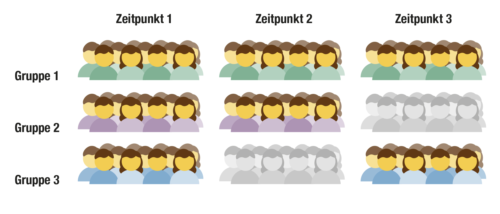

```{r xaringanExtra, echo=FALSE, message=FALSE, warning=FALSE}
#xaringanExtra::use_xaringan_extra(c( "animate_css", "tachyons"))

library(here)
library(tidyverse)
library(ggx)
#source(here("R/scripts.R"))
#source("R/scripts.R")
```

# Ziel der Inferenzstatistik

.hide[fill]
.hide[fill]

.larger[

.read_more[Um aus Daten einer begrenzten Anzahl Personen auf eine große Anzahl von Menschen schließen kann, befassen wir uns mit der Inferenzstatistik.] 

Unser Anspruch an die Inferenz:

.read_more[Generalisierbar]

.read_more[Präzise]

]

---

# Generalisierbarkeit


---

# Generalisierbarkeitserklärung

Ein aktueller Vorschlag ist die Angabe eines expliziten Generalisierbarkeitserklärung über die Ergebnisse, ein sog. _Constraints on Generality (COG) Statement_ 

---

# Teststärke

Statistische Teststärke (_power_): 

---

class: segue-large-red

.bigfont[Was machen wir, wenn wir viele kleine Studien haben?]

---

# Teststärke

---


# Probleme geringer Teststärke

Positiver prädiktiver Wert (PPV): Welcher Anteil von Studien, die ein signifikantes Ergebnis berichten, liegt ein echter Effekt zugrunde?

$$\textrm{Pr(H0 falsch | H0 abgelehnt)}=\frac{\textrm{Pr(H0 abgelehnt | H0 falsch)} \cdot \textrm{Pr(H0 falsch) }}{\textrm{Pr(H0 abgelehnt)}}$$
```{r echo=FALSE}
compute.ppv <- function(power, alpha, r) {
  power*r/(power*r+alpha*(1-r))
}
```
<!--\frac{\left(1-\beta\right) \cdot R}{\left(1-\beta\right) \cdot R + \alpha}$$-->

---
# Illustration der PPV


```{r echo=FALSE}
ballsplot <- function(num.marked, num.visible=100, title="") {
n.rows <- 10
n.cols <- 10
df <- data.frame(x=rep(1:n.cols,n.rows),y=rep(1:n.rows,each=n.cols))
df$z <- factor(c(rep(1,n.rows*n.cols-num.marked),rep(0,num.marked)))
if (num.visible < 100) {
#  dfsub<- df[-((num.visible+1):100),]
  dfsub <- df[-(1:(100-num.visible)),]
} else {
  dfsub <- df
}
ggplot(data=df, aes(x=x,y=y))+
  geom_point(size=10,color="white")+
  geom_point(size=10,data=dfsub,aes(color=z))+
  #cowplot::theme_nothing()+
  theme(legend.position = "none") +
  theme(panel.background = element_rect(fill = "white"))
  #ggtitle(title)

}
```

.pull-left[
Effekt existiert (H0 ist falsch)
```{r echo=FALSE}
# H0 is false, Effekt existiert, wird aber nur selten gefunden
# 20% heißt 10 in 50
ballsplot(10,50, "H0 ist falsch (Effekt existiert)")
```
]

.pull.right[
Kein Effekt (H0 ist wahr)
```{r echo = FALSE}
# H0 is true, no effect, that is, we get only alpha error, 5%
# 5% heißt 2.5 in 50
ballsplot(2,50,"H0 ist wahr (Kein Effekt)")
```
]

---
# Illustration der PPV

.pull-left[
Effekt existiert (H0 ist falsch)
```{r echo=FALSE}
# H0 is false, Effekt existiert, wird aber nur selten gefunden
# 20% heißt 10 in 50
ballsplot(4, 20, "H0 ist falsch (Effekt existiert)")
```
]

.pull.right[
Kein Effekt (H0 ist wahr)
```{r echo = FALSE}
# H0 is true, no effect, that is, we get only alpha error, 5%
# 5% heißt 2.5 in 50
ballsplot(4, 80, "H0 ist wahr (Kein Effekt)")
```
]

---
class:segue-large-red

.large[Welche Auswege gibt es?]


---

# Meta-Analyse

Meta-analysis hilft uns, zu quantifizieren, wie sehr wir angesichts der Evidenz aus mehreren Studien an einen Effekt glauben können

```{r, echo=FALSE, message=FALSE}
require("MASS")
set.seed(4295)
r <- -0.3
test <- function(N) {
data <- mvrnorm(N,mu=c(0,0), Sigma=matrix(c(1,r,r,1),nrow=2))
cor.test(data[,1],data[,2])
}
N1 <- 50
N2 <- 43
N3 <- 55
t1 <- test(N=N1)
t2 <- test(N=N2)
t3 <- test(N=N3)
```

Ein ausgedachtes Beispiel:

- Forscher*in A untersucht den Zusammenhang von IQ and Depression in einer Stichprobe von `N1` Personen und findet einen nicht-signifikanten Zusammenhang (r=`r round(t1$p.value,2)`, n.s.)

-- 

- Forscher*in B berichtet mit einer Stichprobengröße von `N2` ebenfalls einen nicht-signifikanten Effekt (r=`r round(t2$p.value,2)`, n.s.)

--

- Forscher*in C berichten mit einer Stichprobengröße `N3` erneut (r=`r round(t3$p.value,2)`, n.s.)

--

.emph[Wie stark zweifeln Sie nun an der Existenz des Effekts?]

---

# Typische Denkfehler

- Lösung

- Absenz von Evidenz ist nicht gleich Evidenz für Absenz.
  Ein großer p-Wert bedeutet lediglich, dass die Daten under der H0 plausibel sind ()
  

--

# Eine große Studie oder viele kleine?

Es bleibt die Frage: Sollten wir als Disziplin lieber viele kleine Studien (meta-)analysieren oder wenige große?

- Statistisch gesehen ist eine Studie mit N=200 genauso valide wie 10 Studien mit N=20 (angenommen wir ziehen Stichproben aus derselben Population)

- Wir verlieren Präzision in unserer Schätzung, weil wir mehr Parameter in der Meta-Analyse schätzen müssen

.pull-right[

```{r echo=FALSE, message=FALSE}
set.seed(23408)
iqdat <- data.frame(iq=rnorm(n=200,mean=105,sd=15))
library(metafor)

#t.test(iqdat,mu = 100)

datasets <- split(iqdat, f=rep(1:10,each=20))
p.vals <- sapply(datasets, function(x){t.test(x, mu=100)$p.value})
mi <- sapply(datasets, function(x){mean(x$iq)})
sdi <- sapply(datasets, function(x){sqrt(var(x$iq))})

rma_fitted <- metafor::rma(measure="MN", mi=mi, sdi=sdi,ni=rep(20,10))
metafor::forest(rma_fitted)
```

]

---

<!--class:inverse-->
class: sydney-blue


# Das Schubladenproblem (_file drawer problem_)


---

# Effektüberschätzung 

.pull_left[
```{r echo=FALSE}
 selector <- p.vals<0.05
rma_fitted_biased <- metafor::rma(measure="MN", 
                                  mi=mi[selector], 
                                  sdi=sdi[selector],
                                  ni=rep(20,10)[selector])
metafor::forest(rma_fitted_biased)
```
]

---

#

.pull_right[
```{r echo=FALSE}
metafor::funnel(rma_fitted,col=ifelse(selector,"black","red"))
```
]

---

class: segue-large-blue

.bigfont[Wie können wir unsere Studien aussagekräftiger machen?]

---

class: segue-large-blue

.larger[Stichprobengröße ist nicht alles....

.quote[It is more useful to study one animal for 1000 hours than to study 1000 animals for one hour - B.F.Skinner, zitiert in Kerlinger & Lee (1999)]
]
---

# $N$=1

- Klassischerweise sprechen wir meist über die Stichprobengröße als primäre Stellschraube für die Größe einer Studie

.pull-left[

- Die Psychologie hat verschiedene Erfolgsbeispiele, bspw. die .emph[Ebbinghaussche Kurve], die den Grad des Vergessens über einen Zeitraum angibt und im Selbstversuch entdeckt 1885 wurde
]

.pull-right[
```{r echo=FALSE, results='hide'}
x<-c(0, .25, .5, .75, 1,  2,3,4,5,6 ,  7)
y<-c(100,80, 60, 40 , 35, 29,28,27,26,25   , 24)

ggplot(data=data.frame(x,y),aes(x=x,y=y))+#geom_line()+
  xlab("Tage")+ylab("Erinnerungsleistung")+ylim(0,100)+
  geom_smooth(method="gam",se=FALSE,lwd=2)+
  theme_light()+theme(axis.title.x=element_text(size=20))+
  theme(axis.title.y=element_text(size=20))
```
.quote[Schematisch]
]

---

# Generalisierbarkeit

```{r echo=FALSE}
plot_withinbetween <- function(
  with.between=TRUE, 
  with.within=TRUE) {

set.seed(234049)
# simulate within and between person data
between.cor <- .7
within.cor <- -.7
n.between <- 5
n.within <- 20
between.cov <- between.cor*sqrt(15)
person.means <- MASS::mvrnorm(n=n.between, mu=c(100,3), Sigma=matrix(c(15,between.cov,between.cov,1),nrow=2))
#person.means <- matrix(c(
#    100,1.7,
#    100, 2.7,
#    
#), ncol=5, byrow=TRUE)

alldat <- matrix(NA, nrow=n.between*n.within,ncol=3)

betdat <- data.frame(ID=1:n.between,person.means)
colnames(betdat)<-c("ID","IQ","Alkohol")
betdat$ID<-factor(betdat$ID)

for (i in 1:n.between) {
  idx <- ((i-1)*n.within+1):(i*n.within)
  alldat[idx,2:3]<-
 matrix(person.means[i,],nrow=n.within,ncol=2,byrow=TRUE)+
    MASS::mvrnorm(n=n.within, mu=c(0,0), Sigma=matrix(c(1,within.cor,within.cor,1),nrow=2))
  alldat[idx,1]<-i
}

colnames(alldat)<- c("ID","IQ","Alkohol")
alldat<-data.frame(alldat)
alldat$ID<-factor(alldat$ID)

gp <- ggplot(alldat, aes(y=IQ,x=Alkohol, group=ID))+geom_point(aes(color=ID))+
  geom_smooth(aes(color=ID),method="lm",se=FALSE)+ xlab("Alkohol")+ ylab("IQ")
  
if (with.between) {
  gp<-gp+  geom_smooth(data=betdat,aes(group=NULL), method="lm",se=FALSE, color="black")+
   geom_point(data=betdat,aes(color=ID,x=Alkohol,y=IQ),size=5,color="black")+
  geom_point(data=betdat,aes(color=ID,x=Alkohol,y=IQ),size=4)
}
  
return(gp)

}
```

---

# Effizientes Studiendesign


---

# Messfehler reduzieren

.pull-left[

.cite[Image is distributed under CC by Viktor Beekman]

]

---

# Planned Missing Data Designs

```{r}
df<-data.frame(c("Anteil","1/3","1/3","1/3"), c("Set X","X","X","X"), c("Set A","X","X","O"),c("Set B","X","O","X") )
knitr::kable(df)
```

- je 1/3 der Proband\\*innen sieht die Fragen A,B, oder C nicht

- Shortened survey results in about 1/3 more items answered than in complete design given same time constraints

- Or, maintaining survey size, each participant will answer fewer questions

---

# Planned Missing Data Designs



Beispielhaft: Sie haben Versuchsgelder für 210 Messungen und benötigen drei Testungen
anstatt 70 Personen je dreimal testen, können wir ebenso 90 Personen initial testen und dann jeweils nur 60 Personen erneut testen 

.citation[Brandmaier et al. (2020), _Behavior Research Methods_ ]
---

class: seque-blue-larger

.larger[Zusammenfassend: _"Kleine Stichproben sind böse, große Stichproben sind gut"_ ist zu einfach gedacht!

---

# Zusammenfassung

Zwei zentrale Gedanken zur .emph[kleine Stichprobengrößen]:

- Generalisierbarkeit (Gefahr und Chance!)
- Präzision / Statistische Teststärke 

--

.read_more[Planen] Sie Studien mit Sorgfalt unter Beachtung dieser Aspekte
.read_more[Meta-Analysen] für bereits existierende Daten