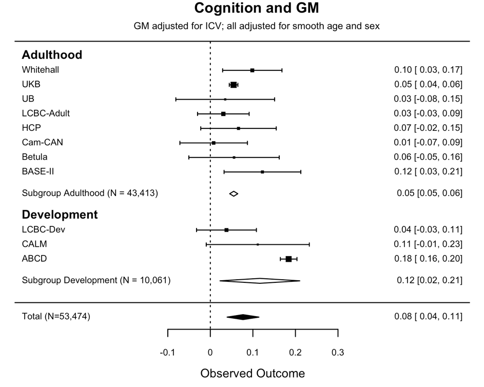
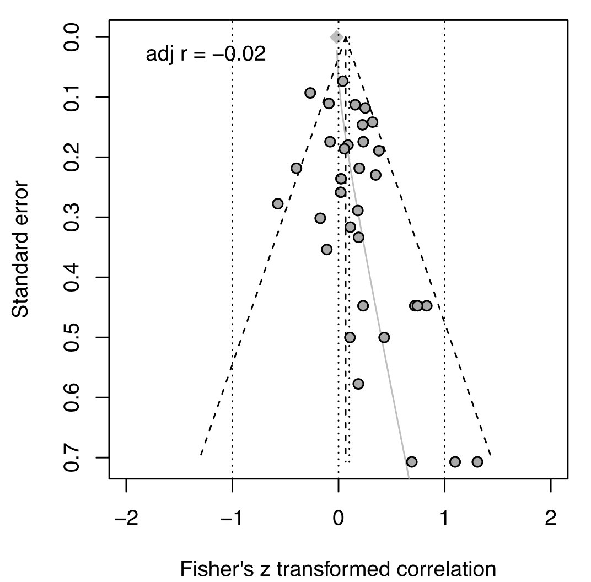

  
```{r xaringanExtra, echo=FALSE, message=FALSE, warning=FALSE}
#xaringanExtra::use_xaringan_extra(c( "animate_css", "tachyons"))

library(here)
library(tidyverse)
library(ggx)
#source(here("R/scripts.R"))
source("R/scripts.R")
source("R/powerplot.R")
```

# Ziel der Inferenzstatistik

.hide[fill]
.hide[fill]

.larger[
  
.read_more[Um aus Daten einer begrenzten Anzahl Personen auf eine große Anzahl von Menschen schließen kann, befassen wir uns mit der Inferenzstatistik.] 
]

--

.larger[
Unser Anspruch an die Inferenz:

  
.read_more[Präzise]
      
.read_more[Valide und generalisierbar]

]

---

# Was ist denn eine _kleine_ Stichprobe?

.larger[
- Es gibt keine harte Grenze für _kleine_ oder _große_ Stichproben
- Abhängig von vielen Faktoren wie Modellkomplexität und Fragestellung
- Stichproben sind dann zu klein, wenn sie nicht genügend Informationen liefern, um unsere Frage zu beantworten (wenn Sie also Präzision, Validität und Generalisierbarkeit in Frage stellen)
]

---

# Stichprobenfehler

Stichprobenfehler:  Streuungsmaß für eine Schätzfunktion für einen unbekannten Parameter  der Grundgesamtheit

- Der Stichprobenfehler hängt direkt von der Stichprobengröße ab

- Beispiel: Standardfehler des arithmetischen Mittels, \frac{\sigma}{\sqrt{n}} mit Standardabweichung $\sigma$ und Stichprobengröße $n$

# Teststärke als Maß der Präzision

.pull-left[
<br>
.larger[
.emph[Statistische Teststärke] (_power_):  die Wahrscheinlichkeit, dass ein Test einen real existierenden Effekt einer angenommenen Größe entdeckt
]

]

--


.pull-right[

]

---

# Wiederholung: Was ist die Teststärke?

<br>
```{r fig.width=12, fig.height=6, echo=FALSE, warning=FALSE}
power_plot(FALSE)
```

Beispiel: Gibt es einen Unterschied im IQ der Studierenden an der MSB und der HUB?
---
# Wiederholung: Was ist die Teststärke?

<br>
```{r fig.width=12, fig.height=6, echo=FALSE}
power_plot(TRUE)
```

Beispiel: Gibt es einen Unterschied im IQ der Studierenden an der MSB und der HUB?

---
  
# Determinanten der Teststärke
<br>
.larger[Statistische Teststärke ist eine Funktion von]
<br><br>
.read_more[Effektstärke] (Bsp.: der wahre Zusammenhang zweier Merkmale, der wahre Gruppenunterschied)

--

.read_more[Irrtumswahrscheinlichkeit] (Typischerweise 5%)

--

.read_more[Präzision] des Messinstruments (Messfehler)

--

.read_more[Stichprobengröße]

--
---

# Probleme geringer Teststärke
<br><br>
.read_more[] Geringe Teststärke ist ein Problem für Sie, da die .emph[Unsicherheit] hoch bleibt (z.B. breite Konfidenzintervalle) und wir die Wahrscheinlichkeit für .emph[Fehler zweiter Art], d.h., ihre Chancen wahre Effekte zu verpassen steigt

- Verschwendung von Forschungsgeldern und Zeit
- Unnötige Belastung von Probanden ist ethisch bedenklich

--

.read_more[] Geringe Teststärke ist ein Problem für ein Forschungsfeld, da die Wahrscheinlichkeit, dass berichtete Effekte falsch sind steigt, d.h, die Anzahl der .emph[Falsch-Positiven Befunde] steigt)

--

.read_more[] _Der Fluch des Gewinners_ führt oft dazu, dass berichtete Effektstärken zu groß sind.


---


# Wieviele Studien berichten korrekte Ergebnisse?

.larger[
<br>
Bisher: .emph[Teststärke] = $Pr$(H0 abgelehnt | H0 ist falsch)
]
--
.larger[
<br>
Wir fragen uns nun: .emph[Wieviele Studien], die ein signifikantes Ergebnis (Nullhypothese abgelehnt) berichten, .emph[sind korrekt]:

$$ Pr(\textrm{H0 ist falsch}\ |\ \textrm{H0 abgelehnt})$$
Auch bekannt als .emph[Positiver Vorhersagewert]
]


---

# Wieviele Studien berichten korrekte Ergebnisse?

.larger[

Anteil der signifikanten Ergebnisse, die wahre Effekte repräsentieren:

$$\textrm{PPV} \propto \frac{Teststärke \cdot Pr(\textrm{H0 falsch}) }{ \alpha \cdot \textrm{Pr(H0 wahr})}$$

- je höher die .emph[Teststärke], desto besser
- je öfter es einen zu testenden Effekt (.emph[H0 ist falsch]) wirklich gibt, desto besser
- je kleiner unser .emph[𝛼], desto besser

]
---

# Illustration der PPV (1:1)

.pull-left[
50 Studien
Effekt existiert (H0 ist falsch)
```{r echo=FALSE, fig.height=5, fig.width=5}
# H0 is false, Effekt existiert, wird aber nur selten gefunden
# 20% heißt 10 in 50
ballsplot(10,50, "H0 ist falsch (Effekt existiert)")
```

Teststärke: 20%
]

.pull.right[
50 Studien
Kein Effekt (H0 ist wahr)
```{r echo = FALSE, fig.height=5, fig.width=5}
# H0 is true, no effect, that is, we get only alpha error, 5%
# 5% heißt 2.5 in 50
ballsplot(2,50,"H0 ist wahr (Kein Effekt)")
```

Fehler 1.Art: 5%
]

<p style="font-size:40px;">
PPV = `r 100*compute.ppv(power=.20, alpha=.05, r=.5)`%
</p>
---

# Illustration der PPV (1:5)

.pull-left[
20 Studien
Effekt existiert (H0 ist falsch)
```{r echo=FALSE, fig.height=5, fig.width=5}
# H0 is false, Effekt existiert, wird aber nur selten gefunden
# 20% heißt 10 in 50
ballsplot(4, 20, "H0 ist falsch (Effekt existiert)")
```

Teststärke: 20%
]

.pull.right[
80 Studien
Kein Effekt (H0 ist wahr)
```{r echo = FALSE, fig.height=5, fig.width=5}
# H0 is true, no effect, that is, we get only alpha error, 5%
# 5% heißt 2.5 in 50
ballsplot(4, 80, "H0 ist wahr (Kein Effekt)")
```

Fehler 1.Art: 5%
]

<p style="font-size:40px;">
PPV = `r 100*compute.ppv(power=.20, alpha=.05, r=.2)`%
</p>
---

class:segue-large-red

.large[Welche Auswege gibt es?]

---

# Stichprobenumfangsplannung

- Studien sollten so gestaltet werden, dass sie eine optimale Teststärke haben (bspw. 80%)

- Gegeben einer Ziel-Teststärke kann man dann die Stichprobengröße errechnen

- Dies erfordert Annahmen über: Fehler 1. Art, Messfehler, und die angenommene Effektstärke

- Durchzuführen bspw. mit G*Power (Faul et al., 2009)

---

# Meta-Analyse

.larger[
- ist eine Studie von Studien 
- hilft uns Evidenz über mehrere Studien zu akkumulieren
- ist besonders nützlich wenn die Einzelstudien inkonklusiv oder widersprüchlich sind
- Meta-Analyse bildet einen Meta-Effektschätzer unter Berücksichtigung der Präzision der Einzelstudien
]

---

# Ein Beispiel

```{r fig.height=3, fig.width=3, echo=FALSE, out.height="55%", out.width="55%"}

```
.citation[Walhovd et al., 2020]
---

# Das Schubladenproblem (_file drawer problem_)

```{r fig.height=3, fig.width=3, echo=FALSE, out.height="70%", out.width="70%"}
knitr::include_graphics("images/maksym-kaharlytskyi-Q9y3LRuuxmg-unsplash.jpg")
```

---

# Beispiel: Der Schubladeneffekt

.pull-left[
- Die Bewertung der Lehre durch Studenten (_student evaluation of teaching_; SET) wird zur Beurteilung der Effektivität der Lehre von Lehrkräften verwendet und basiert auf der weit verbreiteten Annahme, dass Studenten von sehr gut bewerteten Professoren mehr lernen. 

- Primär gestützt durch Meta-Analysen von Studien, die geringe bis mäßige Korrelationen zwischen SET-Bewertungen und Studentenleistungen zeigen 

- Die Ergebnisse waren vermutlich ein Artefakt von Studien mit kleinen Stichproben und Publikationsverzerrungen.
]

.pull-right[
```{r echo=FALSE,incluttl, out.width="80%", out.height="80%"}

```
.citation[Uttl et al. (2016), Studies in Educational Evaluation]
]

---

class: segue-large-blue

.bigfont[N=1]

.larger[It is more useful to study one animal 
for 1000 hours than to study 1000 animals for 
one hour 
 $-$ B.F. Skinner, zitiert in Kerlinger & Lee (1999)]

---

# $N$=1

- Klassischerweise sprechen wir meist über die Stichprobengröße als primäre Stellschraube für die Größe einer Studie

- Messungen kann man aber auch statt über Individuen auch "innerhalb" von Individuen (also über die Zeit hinweg) verteilen

.pull-left[

- Die Psychologie hat verschiedene Erfolgsbeispiele, bspw. die .emph[Ebbinghaussche Kurve], die den Grad des Vergessens über einen Zeitraum angibt und im Selbstversuch 1885 entdeckt  wurde
]

.pull-right[
```{r echo=FALSE, results='hide', warning=FALSE,message=FALSE, fig.width=4,fig.height=4}
x<-c(0, .25, .5, .75, 1,  2,3,4,5,6 ,  7)
y<-c(100,80, 60, 40 , 35, 29,28,27,26,25   , 24)

ggplot(data=data.frame(x,y),aes(x=x,y=y))+#geom_line()+
  xlab("Tage")+ylab("Erinnerungsleistung")+ylim(0,100)+
  geom_smooth(method="gam",se=FALSE,lwd=2)+
  theme_light()+theme(axis.title.x=element_text(size=20))+
  theme(axis.title.y=element_text(size=20))
```

]

---

# Validität der Inferenz

.pull-left[
.emph[Welche Frage wollen wir eigentlich beantworten?]

Beispiel: Wir interessieren uns für den Zusammenhang von IQ und Alkoholkonsum

Vgl. Alkoholkonsum und IQ sind positiv korreliert (UK; Batty et al., 2008)
]

.pull-right[
```{r message=FALSE, results='hide', echo=FALSE}
plot_withinbetween(with.between=TRUE, with.within = FALSE)
```
]
---

# Validität der Inferenz

.pull-left[
.emph[Welche Frage wollen wir eigentlich beantworten?]

Beispiel: Wir interessieren uns für den Zusammenhang von IQ und Alkoholkonsum

Vgl. Alkoholkonsum und IQ sind positiv korreliert (UK; Batty et al., 2008)

]

.pull-right[
```{r message=FALSE, results='hide', echo=FALSE}
plot_withinbetween(with.between=TRUE, with.within = TRUE)
```
]

---

# Anmerkung: Sehr kleine Stichproben

Bei sehr kleinen Stichproben können asymptotische Annahmen der Schätzer verletzt sein. Je nach Modellklasse gibt es dann sehr unterschiedliche Ansätze:

- Analytische Korrekturansätze (Kenward-Roger-Korrektur für Mehrebenenmodelle)
- Bootstraps für Standardfehler (statt Verlass auf den zentralen Grenzwertsatz)
- Bayesianische Methoden 

Einfache Tests wie t-Tests sind aber sogar in sehr kleinen Stichproben robust

---

# Zusammenfassung

Zwei zentrale Gedanken zur .emph[kleine Stichprobengrößen]:

- Validität (Beantworten wir wirklich die Frage, die wir beantworten wollten?)
- Präzision (Beantworten wir die Frage so, dass uns die Antwort einen nutzen bringt?)

--

.read_more[Planen] Sie Studien mit Sorgfalt unter Beachtung dieser Aspekte

.read_more[Meta-Analysen] für bereits existierende Daten (aber achten Sie auf mögliche Schubladeneffekte)
