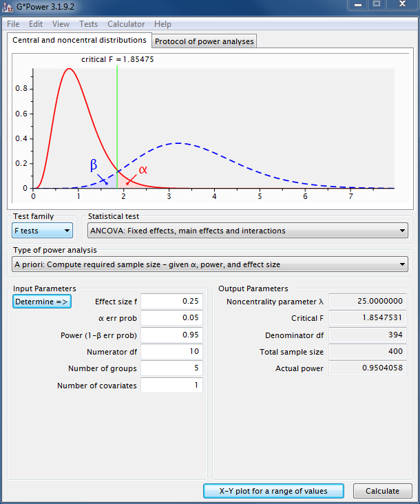

  
```{r xaringanExtra, echo=FALSE, message=FALSE, warning=FALSE}
#xaringanExtra::use_xaringan_extra(c( "animate_css", "tachyons"))

library(here)
library(tidyverse)
library(ggx)
#source(here("R/scripts.R"))
source("R/scripts.R")
source("R/powerplot.R")
source("R/variability.R")
```

# Ziel der Inferenzstatistik

.hide[fill]
.hide[fill]

.larger[
  
.read_more[Um aus Daten einer begrenzten Anzahl Personen auf eine große Anzahl von Menschen schließen kann, befassen wir uns mit der Inferenzstatistik.] 
]

--

.larger[
Unser Anspruch an die Inferenz:

  
.read_more[Präzise]
      
.read_more[Valide und generalisierbar]

]

---

# Was ist denn eine _kleine_ Stichprobe?

.larger[
- Es gibt keine harte Grenze für _kleine_ oder _große_ Stichproben
- Abhängig von vielen Faktoren wie Modellkomplexität und Fragestellung
- Stichproben sind dann .emph[zu klein], wenn sie nicht genügend Informationen liefern, um unsere Frage zu beantworten (wenn Sie also Präzision, Validität und Generalisierbarkeit in Frage stellen)
]

---

# Auswirkung auf den Stichprobenfehler

.pull-left[
Stichprobenfehler: 

- Durchschnittliche Abweichung des geschätzten Parameterwertes vom wahren Parameterwert

- Große Stichproben minimieren den Einfluss von zufälligen Schwankungen in der Zusammensetzung der Vergleichsgruppen und erhöhen dadurch die Präzision
 
- Beispiel: Standardfehler des arithmetischen Mittels, $\frac{\sigma}{\sqrt{n}}$ mit Standardabweichung $\sigma$ und Stichprobengröße $n$
]

.pull-right[
```{r echo=FALSE}
variabilityplot()
```
]

---

# Teststärke und kleine Stichproben

.pull-left[
<br>
.larger[
.emph[Statistische Teststärke] (_power_):  die Wahrscheinlichkeit, dass ein Test einen real existierenden Effekt einer angenommenen Größe entdeckt
]

]


.pull-right[

]

---

# Wiederholung: Was ist die Teststärke?

<br>
```{r fig.width=12, fig.height=6, echo=FALSE, warning=FALSE}
power_plot(FALSE)
```

Beispiel: Sind Studierende an der MSB überdurchschnittlich intelligent?
---
# Wiederholung: Was ist die Teststärke?

<br>
```{r fig.width=12, fig.height=6, echo=FALSE}
power_plot(TRUE)
```

Beispiel: Sind Studierende an der MSB überdurchschnittlich intelligent?

---
  
# Determinanten der Teststärke
<br>
.pull-left[
.larger[Statistische Teststärke ist eine Funktion von]
<br><br>
.read_more[Effektstärke] (Bsp.: der wahre Zusammenhang zweier Merkmale, der wahre Gruppenunterschied)

.read_more[Irrtumswahrscheinlichkeit] (Typischerweise 5%)

.read_more[Präzision] des Messinstruments (Messfehler)

.read_more[Stichprobengröße]

]

.pull-right[
```{r fig.width=12, fig.height=6, echo=FALSE}
power_plot(TRUE)
```
]
---

# Probleme geringer Teststärke
<br><br>
.read_more[] Geringe Teststärke ist ein Problem für Sie, da die .emph[Unsicherheit] hoch bleibt (z.B. breite Konfidenzintervalle) und wir die Wahrscheinlichkeit für .emph[Fehler zweiter Art], d.h., ihre Chancen wahre Effekte zu verpassen steigt

--

- Verschwendung von Forschungsgeldern und Zeit
- Unnötige Belastung von Probanden ist ethisch bedenklich

--

.read_more[] _Der Fluch des Gewinners_ führt oft dazu, dass publizierte Effektstärken  zu groß sind (große Zufallsschwankung + Publikationsverzerrung).

--

.read_more[] Geringe Teststärke ist ein Problem für ein Forschungsfeld, da die Wahrscheinlichkeit, dass berichtete Effekte falsch sind steigt, d.h, die Anzahl der .emph[Falsch-Positiven Befunde] steigt)


---


# Wieviele Studien berichten korrekte Ergebnisse?

.larger[
<br>
Bisher: .emph[Teststärke] = $Pr$(H0 abgelehnt | H0 ist falsch)
]
--
.larger[
<br>
Wir fragen uns nun: .emph[Wieviele Studien], die ein signifikantes Ergebnis (Nullhypothese abgelehnt) berichten, .emph[sind korrekt]:

$$Pr(\textrm{Wahrer Effekt}\ |\ \textrm{Signifikantes Ergebnis})$$
$$ = Pr(\textrm{H0 ist falsch}\ |\ \textrm{H0 abgelehnt})$$
Auch bekannt als .emph[Positiver Vorhersagewert]
]


---

# Wieviele Studien berichten korrekte Ergebnisse?

.larger[

Anteil der signifikanten Ergebnisse, die wahre Effekte repräsentieren:

$$\textrm{PPV} \propto \frac{Teststärke \cdot Pr(\textrm{H0 falsch}) }{ \alpha \cdot \textrm{Pr(H0 wahr})}$$

Kleine Stichprobe $\Rightarrow$ Kleine Teststärke $\Rightarrow$ Niedrige PPV

]
---

# Illustration der PPV

.pull-left[
20 Studien<br>
Effekt existiert (H0 ist falsch)
```{r echo=FALSE, fig.height=5, fig.width=5}
# H0 is false, Effekt existiert, wird aber nur selten gefunden
# 20% heißt 10 in 50
ballsplot(4, 20, "H0 ist falsch (Effekt existiert)")
```

Teststärke: 20%
]

.pull.right[
80 Studien<br>
Kein Effekt (H0 ist wahr)
```{r echo = FALSE, fig.height=5, fig.width=5}
# H0 is true, no effect, that is, we get only alpha error, 5%
# 5% heißt 2.5 in 50
ballsplot(4, 80, "H0 ist wahr (Kein Effekt)")
```

Fehler 1.Art: 5%
]

<p style="font-size:40px;">
PPV = `r 100*compute.ppv(power=.20, alpha=.05, r=.2)`%
</p>
---

class:segue-large-red

.bigfont[Welche Auswege gibt es?]

---

# Stichprobenumfangsplannung

.pull-left[
- Studien sollten so gestaltet werden, dass sie eine ausreichende Teststärke haben (bspw. > 80%) 

- Gegeben einer Ziel-Teststärke kann man dann die Stichprobengröße errechnen

- Dies erfordert Annahmen über: Fehler 1. Art, Messfehler, und die angenommene Effektstärke

- Durchzuführen bspw. mit G*Power (Faul et al., 2009)

]

.pull-right[
```{r echo=FALSE}

```
]

---

# Meta-Analyse

.larger[
- ist eine Studie von Studien 
- hilft uns Evidenz über mehrere Studien zu akkumulieren
- ist besonders nützlich wenn die Einzelstudien inkonklusiv oder widersprüchlich sind
- Meta-Analyse bildet einen Meta-Effektschätzer unter Berücksichtigung der Präzision der Einzelstudien
- Vorsicht vor dem Schubladen-Effekt (Fluch des Gewinners)!
]

---

# Ein Beispiel

```{r fig.height=3, fig.width=3, echo=FALSE, out.height="55%", out.width="55%"}
knitr::include_graphics("images/meta-analyse-gm-cog.png")
```
.citation[Walhovd et al., 2020]
---

class: segue-large-red

.bigfont[N=1]

.larger[It is more useful to study one animal 
for 1000 hours than to study 1000 animals for 
one hour 
 $-$ B.F. Skinner, zitiert in Kerlinger & Lee (1999)]

---

# $N$=1

- Klassischerweise sprechen wir meist über die Stichprobengröße als primäre Stellschraube für die Größe einer Studie

- Messungen kann man aber auch statt über Individuen auch "innerhalb" von Individuen (also über die Zeit hinweg) verteilen

.pull-left[

- Die Psychologie hat verschiedene Erfolgsbeispiele, bspw. die .emph[Ebbinghaussche Kurve], die den Grad des Vergessens über einen Zeitraum angibt und im Selbstversuch 1885 entdeckt  wurde
]

.pull-right[
```{r echo=FALSE, results='hide', warning=FALSE,message=FALSE, fig.width=4,fig.height=4}
x<-c(0, .25, .5, .75, 1,  2,3,4,5,6 ,  7)
y<-c(100,80, 60, 40 , 35, 29,28,27,26,25   , 24)

ggplot(data=data.frame(x,y),aes(x=x,y=y))+#geom_line()+
  xlab("Tage")+ylab("Erinnerungsleistung")+ylim(0,100)+
  geom_smooth(method="gam",se=FALSE,lwd=2)+
  theme_light()+theme(axis.title.x=element_text(size=20))+
  theme(axis.title.y=element_text(size=20))
```

]

---

# Validität der Inferenz

.pull-left[
.emph[Welche Frage wollen wir eigentlich beantworten?]

Beispiel: Wir interessieren uns für den Zusammenhang von IQ und Alkoholkonsum

Vgl. Alkoholkonsum und IQ sind positiv korreliert (UK; Batty et al., 2008)
]

.pull-right[
```{r message=FALSE, results='hide', echo=FALSE}
plot_withinbetween(with.between=TRUE, with.within = FALSE)
```
]
---

# Validität der Inferenz

.pull-left[
.emph[Welche Frage wollen wir eigentlich beantworten?]

Beispiel: Wir interessieren uns für den Zusammenhang von IQ und Alkoholkonsum

Vgl. Alkoholkonsum und IQ sind positiv korreliert (UK; Batty et al., 2008)

]

.pull-right[
```{r message=FALSE, results='hide', echo=FALSE}
plot_withinbetween(with.between=TRUE, with.within = TRUE)
```
]

---

# Das Beste aus beiden Welten

- In der psychologischen Forschung bietet es sich an, Modelle sowohl für .emph[interindividuelle] als auch .emph[intraindividuelle] Fragestellungen zu schätzen. 

- Geeignet sind zum Beispiel Mehrebenen-Modelle oder Strukturgleichungsmodelle

- Forschungsfragen können dabei sowohl auf mittlere intraindivuelle Effekte abzielen als auch auf interindividuelle Unterschiede in den intraindividuellen Effekten

- Viele Freiheitsgrade in der Versuchsdesignplanung (z.B., nicht nur Stichprobengröße sondern auch Anzahl der Messungen pro Person und Bedingung)

---

# Zusammenfassung

Zwei zentrale Gedanken zur .emph[kleine Stichprobengrößen]:

- Validität (Beantworten wir wirklich die Frage, die wir beantworten wollten?)
- Präzision (Beantworten wir die Frage so, dass uns die Antwort einen nutzen bringt?)

--

.read_more[Planen] Sie Studien mit Sorgfalt unter Beachtung dieser Aspekte!

.read_more[Meta-Analysen] für bereits existierende Daten (aber achten Sie auf mögliche Schubladeneffekte)

